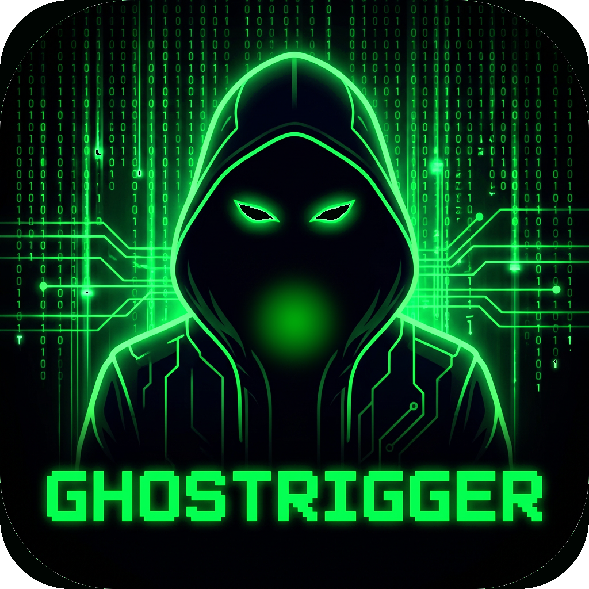

<p align="center">
  
</p>

# Ghost-Studio

**A KOTOR 1 and KOTOR 2 modding suite for model inspection, animation
retargeting, character building, module editing, map authoring, and safe
export workflows.**

Ghost-Studio is a hybrid Visual Studio C++ host plus embedded Python Qt/PySide6
desktop application. It is built for *Star Wars: Knights of the Old Republic*
and *The Sith Lords* modding workflows, with a strong bias toward preserving
source game data, validating outputs, and keeping user-facing tools separated
from reusable core systems.

The active development branch is `ghost-studio`.

> **Naming note:** the product is **GhostStudio** (formerly GhostRigger).
> Internal build identifiers still carry the original name for stability —
> the solution is `GhostRigger.sln`, native packages live under
> `native/GhostRigger.*`, environment variables use the `GHOSTRIGGER_` prefix,
> while both supported Windows build paths output `GhostStudio.exe`. The
> remaining GhostRigger identifiers are architectural identities; renaming
> them would break the build and orphan user settings, so they remain stable.

Ghost-Studio is not affiliated with LucasArts, BioWare, Obsidian, Disney,
Aspyr, or Autodesk. KOTOR game assets and Autodesk FBX SDK binaries are not
bundled.

## What It Is

Ghost-Studio is organized as four authoring studios over shared project,
resource, validation, export, scene, and native-runtime foundations.

| Studio | Purpose | Current Status |
|--------|---------|----------------|
| Character Studio | Import custom FBX/OBJ/glTF meshes, fit them to native KOTOR model hierarchies, bind/skin, preview animations and attachments, and export MDL/MDX candidates. | Active development. The main launch risk is exact Odyssey node-DAG preservation and golden playable exports. |
| Retarget Studio | Retarget animations between Unreal/Mixamo/FBX and KOTOR, KOTOR to KOTOR, and KOTOR to Unreal. | Advanced partial. Unreal/Mixamo to KOTOR is strongest; the other lanes are being brought up to the same preview/export/readback standard. |
| Module Studio | Hydrate, inspect, edit, validate, and safely save existing KOTOR modules and resources. | Backend services exist for hydration, GFF object forms, WOK editing, save manifests, and reference checks; visible editing and undo remain active work. |
| Map Studio | Author and edit KMAP-backed areas: import stock modules, edit room geometry with the Maya-style modeling shelf, paint textures live, sculpt terrain, place and configure gameplay objects, author lighting/lightmaps/skyboxes, simulate with Play-in-Editor, and package/export playable modules. | The full authoring loop works: stock import with rendered creature/placeable previews (including grafted appearance.2da heads), interactive drag/marquee multi-select with single-command undo, live map-wide texture painting with background same-ResRef cloning and an `Apply Textures` export gate, terrain sculpting with carve/fill holes and multi-loop floor-only WOK output, placement/behavior/transition authoring, world lighting and per-surface lightmap bake, five-face skyboxes and sky traffic, plus a PIE walkmesh/gameplay simulator (entity registry landed; targeting, interaction, dialogue, and combat are in progress). The user-operated in-game `warp` acceptance test of a fully authored module is the remaining proof gate. |

Shared foundations already in the repository include `GhostRiggerProject`,
`ResourceAddress`, `GameResourceProvider`, `ValidationBus`, `ExportJob`,
provider-backed resource models, native package boundaries, and embedded Python
payload generation.

## Highlights

- Qt-only desktop UI; the legacy Tk UI is retired.
- Scene-based main viewport with KMAX scene files, cameras, lights, pivots,
  transforms, gizmos, measurements, render diagnostics, and multi-object state.
- Game-library and resource browsing for K1/K2 KEY/BIF/RIM/ERF/MOD/Override
  layers.
- Retarget workbench with explicit source/target/output concepts and staged
  export gates.
- Character Builder with base skeleton selection, external mesh fit helpers,
  native skeleton build flow, supermodel assignment, BAS attachment preview,
  validation, and export preflight.
- Body Attachment System for head, weapon, mask, goggle, belt, and equipment
  socket preview recipes, with a game-derived item catalog covering every
  attachable model from both installed games and a lightsaber Color selector
  spanning all K1/K2 blade colors (including the K2-only Viridian, Silver,
  and Bronze). The same panel is embedded in the Character Builder preview
  step.
- Lightsaber preview support for powered blade animation, game-color blade
  textures, and preview-only color overrides.
- Map Studio: import a stock KOTOR module with real rendered previews
  (creatures receive their appearance.2da heads at the body headhook),
  model rooms with the Maya-style shelf (live extrude/bevel previews, true
  Combine/Separate, Multi-Cut), paint textures directly on rendered rooms
  with Substance-informed brushes and one-transaction map-wide texture
  cloning, sculpt terrain with carve/fill holes and adaptive floor-only WOK
  output, place and configure creatures/placeables/doors/waypoints/triggers
  and room lights, bake per-surface lightmaps, author five-face skyboxes and
  animated sky traffic, and export a playable `.mod` with
  WOK/LYT/VIS/ARE/GIT/IFO/PTH — gated by raw vanilla-derived engine-contract
  validation and packaged-archive readback.
- Play-in-Editor (PIE): a deterministic editor simulator with click-to-move
  walkmesh navigation, camera and player animation, prepared creature actors,
  ambient audio, and a gameplay entity registry. PIE reports every
  unsupported behavior in its coverage warnings and is never presented as
  KOTOR engine proof.
- Native Visual Studio package tree with canonical owners under
  `native/GhostRigger.*`.

## Current Critical Path

The active roadmap is
[`knowledge_base/roadmap/02_roadmap_2026_05.md`](knowledge_base/roadmap/02_roadmap_2026_05.md).
Despite the filename, it was regenerated on 2026-06-21 and is the current suite
roadmap. A focused Map Studio audit lives at
[`Saved/Codex/brief_map_studio_full_audit.md`](Saved/Codex/brief_map_studio_full_audit.md).

Near-term priorities:

1. Expand PIE into a gameplay simulator: target acquisition and the focus
   circle HUD, a central interaction router (containers, terminals, doors,
   creatures, triggers), dialogue traversal, deterministic combat rounds, and
   cutscene sequencing — with every unsupported behavior reported honestly.
2. The user-operated in-game acceptance test: author a custom module fully
   through the Map Studio UI, export, install, and manually `warp` into it in
   KOTOR 2 to confirm every system in the actual engine.
3. A transactional Build & Test install workflow (hash-verified staging,
   game-running gate, atomic replace, rollback) replacing the current plain
   file copy.
4. Typed template deep links (`Edit Template` / `Create Variant` for
   UTC/UTD/UTT/UTE/UTS/UTM/UTW) and the Qt-free narrative core
   (script compile, dialogue, quest services).
5. Lock Character Studio native KOTOR DAG snapshot and clone-before-bind
   flow; bring the remaining Retarget Studio lanes up to the
   preview/export/readback discipline of Unreal/Mixamo-to-KOTOR.

## Requirements

Recommended Windows development/runtime:

- Windows 10 or newer.
- Python 3.13 or newer (development currently runs on 3.14; 3.12 remains
  usable for the Qt source-run path).
- Visual Studio 2022 or the VS 2022 Build Tools (MSBuild) for the native
  Debug application build.
- A legal local installation of KOTOR (K1) and/or KOTOR II: The Sith Lords
  (K2). Game assets are read in place and never bundled or modified without
  an explicit export.
- Blender 4.2 LTS for the production Blender FBX backend.
- Optional Autodesk FBX SDK installed manually for SDK-backed FBX workflows.

## Installation

### Option A: Native application (recommended)

The primary product is the payload-backed native application. It embeds the
Python packages into 18 native DLLs and is what all visible testing runs
against.

```bat
git clone https://github.com/CrispyW0nton/Ghost-Studio.git
cd Ghost-Studio
git switch ghost-studio
py -3.14 -m pip install -r requirements.txt
"C:\Program Files (x86)\Microsoft Visual Studio\2022\BuildTools\MSBuild\Current\Bin\MSBuild.exe" GhostRigger.sln /m /t:Build /p:Configuration=Debug /p:Platform=x64 /v:minimal
```

(Adjust the MSBuild path for your VS 2022 edition, or build `GhostRigger.sln`
as `Debug|x64` from Visual Studio.)

Run the result:

```bat
build\vs\x64\Debug\GhostStudio.exe
```

The build regenerates the embedded Python payloads automatically and stages
all 18 payload DLLs next to the executable.

### Option B: Run from source

```bat
git clone https://github.com/CrispyW0nton/Ghost-Studio.git
cd Ghost-Studio
git switch ghost-studio
pip install -r requirements.txt
python main.py
```

### First launch (either option)

1. Open Settings / Game Paths.
2. Configure K1 and/or K2 install paths (for Steam these are typically
   `C:\Program Files (x86)\Steam\steamapps\common\swkotor` and
   `...\Knights of the Old Republic II`).
3. Scan or refresh the game library.
4. Load a model from the Content Browser, or open Map Studio from the
   Module Editor icon to author a map.
5. Save multi-object editor scenes as `.kmax`; Map Studio projects save as
   `.kmap`.

Ghost-Studio scene files store references and lightweight editor state. They
should not embed large proprietary KOTOR asset bytes.

## Building

### PyInstaller App Bundle

```bat
build.bat
```

`build.bat` resolves Python, installs `requirements.txt`, installs PyInstaller
hook helpers, compiles build-critical entry points, and runs:

```bat
python -m PyInstaller GhostRigger-K1-K2.spec --clean --noconfirm
```

Successful output:

```text
dist\GhostStudio.exe
```

Build output is written to `build_log.txt`.

### Native Solution

Native work lives in `GhostRigger.sln` and `native/GhostRigger.*`.

The payload-backed Debug application is
`build\vs\x64\Debug\GhostStudio.exe`. The repository-root copy is a
source-backed developer convenience launcher; it is runnable inside this
checkout, but it is not a portable standalone distribution without the native
payload DLLs and runtime assets from the build directory.

- Use Visual Studio for normal Debug/Release native package work.
- Keep package ownership aligned with
  [`knowledge_base/package_ownership_model.md`](knowledge_base/package_ownership_model.md).
- Edit canonical Python under root `src/...` first when a matching source file
  exists.
- Regenerate embedded Python payload copies after canonical packaged Python
  changes (`python scripts/native_python_payload_generator.py <Project>`).
- Do not hand-edit `native/<Project>/Python/src/...` copies to diverge from
  root source. Python source is mirrored across the owning native package
  tree(s) **and** the root `src/` tree; all copies must stay byte-identical or
  payload regeneration fails.

## Main Workflows

### Main Viewport And KMAX

The main viewport is a scene editor, not a single-model viewer.

Use it for loading and comparing K1/K2 models, inspecting MDL/MDX hierarchies,
previewing textures/lights/cameras/helpers/skins, transforming scene objects,
editing pivots, authoring cameras/lights, and saving `.kmax` scenes.

Workflow-specific controls belong in their owning workbench. Retarget mode,
source animation choices, output naming, and retarget export controls belong in
Retarget Studio, not the main viewport chrome.

### Retarget Studio

Supported product lanes:

- Unreal/Mixamo/FBX source animation to KOTOR target model.
- KOTOR source animation to KOTOR target model.
- KOTOR source animation to Unreal target skeleton.

Exports should only happen after preview and readback gates pass. Vanilla-slot
overrides and custom animation patches are separate output modes.

### Character Studio

Character Studio is the custom-character pipeline. The intended modder flow is:

1. Choose a base KOTOR model/skeleton.
2. Load a custom mesh.
3. Auto-fit using native KOTOR landmarks and reference bounds.
4. Fine-tune guides and mesh fit.
5. Clone/confirm the native KOTOR node hierarchy.
6. Bind skin rows.
7. Assign inherited supermodel or local animations.
8. Preview heads, weapons, masks, goggles, belts, and attachments.
9. Run validation/export preflight.
10. Export MDL/MDX candidates and test in game.

Do not claim a custom character is game-ready until viewport preview, export
readback, and in-game testing have passed.

### Module Studio And Map Studio

Module Studio edits existing KOTOR module resources. Map Studio authors and
edits custom modules and areas. Both must preserve source game data unless the
user explicitly chooses an export/write operation.

Map Studio editing flow:

1. **File -> Import Stock Module (RIM)** or **Rooms -> Load LYT** to hydrate a
   vanilla module (rooms, placements, GIT/IFO entry data — creatures render
   with their real bodies and heads), or start a fresh authored module from a
   room preset or terrain patch.
2. **File -> Make All Stock Rooms Editable** (or edit a hovered stock room,
   which auto-converts it) to turn read-only stock geometry into editable
   imported-mesh rooms.
3. Model with the Maya-style shelf: Object/Vertex/Edge/Face/Terrain/Walkmesh
   modes with Select, Move, Dupe, Delete, Snap, Weld, Cut, Split, Bridge,
   Extrude, and Bevel. Extrude and Bevel preview live topology before commit;
   Combine/Separate produce real polygon meshes. Plain click-drag marquee
   (or Ctrl+drag) box-selects objects; Delete removes the whole selection as
   one undoable command; End drops a placement to the walkable ground;
   W/E/R switch gizmo modes; Ctrl+Z / Ctrl+R undo/redo, and undoing a
   placement move repaints just that object.
4. Paint: clone used room textures into project TGA/TXI overrides (map-wide,
   background, cancellable, one undo transaction) and paint directly on the
   rendered map with size/hardness/opacity/flow/spacing/jitter and
   pressure-aware brushes; commit with the `Apply Textures` export gate.
5. Sculpt terrain with raise/lower/smooth/flatten/ramp brushes, carve or fill
   floor holes (the exported walkmesh gains real interior perimeter loops),
   and validate the generated floor-only WOK with the live green/red
   walkability overlay.
6. Place creatures, placeables, doors, waypoints, triggers, sounds, and room
   lights; author faction/roam behavior, conversations, locks, transitions,
   world lighting, per-surface lightmaps, five-face skyboxes, and sky
   traffic.
7. Press Play for PIE simulation (click-to-move walkmesh navigation with
   honest coverage reporting), then Validate, stage, and export a playable
   `.mod` — every writer output passes raw vanilla-derived engine-contract
   checks and archive readback before install.
8. Install the exported module and manually `warp` into it in game. PIE and
   editor validation are never a substitute for that in-game proof.

New geometry is textured with world-space tiled UVs matched to the room's
existing texture density so it blends with vanilla; polycount guardrails warn
before KOTOR MDL limits.

## FBX Backends

Ghost-Studio keeps FBX backends explicit.

| Backend | Use | Notes |
|---------|-----|-------|
| Blender Headless | Production FBX import/export bridge for animation and mesh extraction. | Requires Blender 4.2 LTS or `GHOSTRIGGER_BLENDER_PATH`. |
| Autodesk FBX SDK | Optional SDK-backed path. | Must be installed manually. SDK binaries are not committed or bundled. |
| Generic Assimp paths | Legacy/static mesh import support. | Useful for some main-viewport file imports, not a replacement for Retarget Studio animation import. |

Autodesk SDK smoke check:

```bat
python -c "import fbx; m=fbx.FbxManager.Create(); print(m.GetVersion()); m.Destroy()"
```

Blender is not treated as a silent fallback for Autodesk SDK requests. If a
workflow asks for Autodesk and the SDK is missing, Ghost-Studio should fail with
an actionable setup message unless that workflow explicitly opts into a
fallback.

## Validation And Export Safety

Export workflows should:

1. Run validation/preflight before writing.
2. Stage output files.
3. Verify staged outputs.
4. Promote files only after verification.
5. Avoid partial writes.
6. Report actionable issues through `ValidationBus`.

KOTOR source data should never be overwritten silently.

## Testing

Prefer targeted checks:

```bat
python -m py_compile main.py
python -m pytest tests/test_fbx_backend_registry.py -q
python -m pytest tests/test_character_builder_template_rig.py -q
python -m pytest tests/test_map_studio_terrain_patch.py -q
python -m pytest tests/test_authored_imported_mesh.py -q
```

Use MCP/game-file validation tools for model-pipeline truth: MDL loading,
vertex transforms, textures, skinning, model comparison, and game-file parsing.

Visible UI, startup, viewport, theme/layout, renderer, animation playback, and
workflow behavior must be tested in the real Ghost-Studio Debug application.
Backend probes are not a substitute for visible workflow testing.

Do not run broad full scans unless the task explicitly requires them.

## Repository Map

```text
src/                         Canonical Python source for app and domain logic.
native/                      Visual Studio C++ package tree and embedded Python payloads.
config/                      Themes, layouts, and runtime configuration assets.
assets/icons/                Application icon assets.
examples/                    Example KMAX/KMAP and workflow data.
scripts/                     Build, payload, validation, smoke, and utility scripts.
tests/                       Targeted unit, contract, workflow, native, and regression tests.
knowledge_base/              Active roadmap, architecture, native migration, and references.
docs/knowledgebase/          Local book-derived agent skill notes.
Saved/Codex/                 Design briefs and audits (e.g. the Map Studio full audit).
```

## Documentation

Start here:

- [Active roadmap](knowledge_base/roadmap/02_roadmap_2026_05.md)
- [Roadmap index](knowledge_base/roadmap/README.md)
- [Package ownership model](knowledge_base/package_ownership_model.md)
- [Native migration plan](knowledge_base/native_migration_plan.md)
- [C++ integration phases](knowledge_base/cpp_integration_phases.md)
- [Map Studio full audit](Saved/Codex/brief_map_studio_full_audit.md)
- [Knowledge base index](knowledge_base/README.md)
- [Agent operating manual](AGENTS.md)

## Branch And Contribution Policy

- Primary development branch: `ghost-studio` (formerly `qt-ghostrigger`).
- Legacy branches are historical references; do not base new feature work on
  them.
- Commit messages should include the relevant roadmap task ID when one applies.
- Future PRs should target `ghost-studio`.
- Keep generated output, proprietary game assets, local screenshots, books, and
  dependency caches out of commits unless a tracked fixture is explicitly
  required.

## License And Legal

See [LICENSE](LICENSE).

Ghost-Studio does not bundle KOTOR game assets or Autodesk FBX SDK binaries.
Users are responsible for using legal local game installs and third-party SDKs
according to their licenses.
