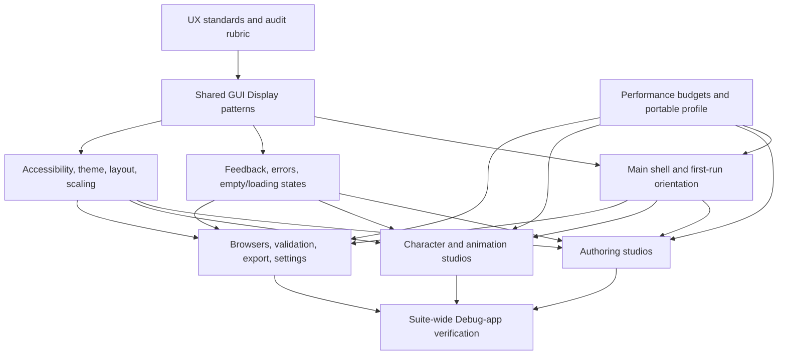
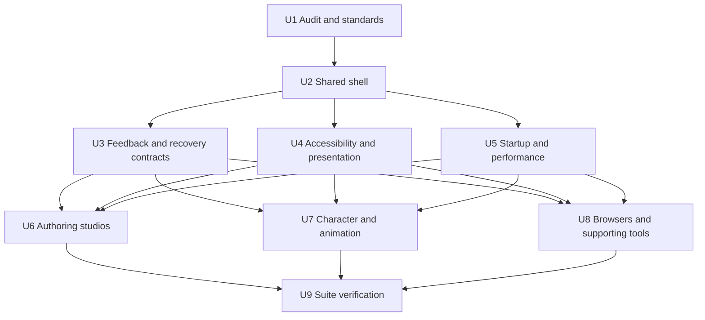

# GhostStudio Program-Wide UI and UX Overhaul - Plan

## Goal Capsule

- **Objective:** Make GhostStudio understandable, responsive, accessible, and recoverable across the main shell and every major studio without removing expert capability.
- **Product authority:** User-reported confusion, the four UX books cited in this plan, `AGENTS.md`, `knowledge_base/roadmap/02_roadmap_2026_05.md`, and the owning workflow contracts.
- **Technical authority:** `knowledge_base/package_ownership_model.md`, the Qt/theme/layout system, existing headless domain services, and native Python payload manifests.
- **Execution profile:** Ship the goal as isolated reviewable units. Each unit must improve a complete user task, include focused automated checks, and receive visible Debug-application verification before it is considered done.
- **Stop conditions:** Do not trade away KOTOR data safety, hide export truth, move business rules into widgets, block the UI thread, overwrite user layouts, or include unrelated work from the shared root checkout.
- **Tail ownership:** The final unit owns suite-wide consistency, performance retesting, theme/accessibility coverage, documentation, changelog evidence, and GitHub publication.

---

## Product Contract

### Summary

GhostStudio will use one recognizable interaction model across its shell and studios: show the current context, expose the next meaningful actions, reveal advanced controls when needed, report what the system is doing, and make failure recoverable. The overhaul will begin with shared shell and feedback patterns, then apply them to each product workflow and verify the complete suite in the actual Debug application.

### Problem Frame

Recent Map Studio feedback exposed program-level usability failures rather than isolated documentation gaps. A user could not tell whether grey space was usable floor, whether a green triangular overlay was a floating walkmesh, what a room Blueprint represented, how custom UTC resources entered the placement catalog, or why a Gizka UTC could not be placed. Each question traces to one or more missing signifiers, hidden system state, mismatched terminology, absent recovery guidance, or a workflow that asks the user to construct derived data manually.

The main shell currently places a large number of icon-only actions into one command strip and a very long Tools menu. It exposes products as both “Builder” and “Studio,” mixes ordinary authoring with diagnostics and IPC controls, constructs many dormant panels during startup, and resets some saved layout choices. These patterns make the interface harder to scan, increase decision time, weaken the user’s mental model, and impose unnecessary cost on lower-spec machines.

The overhaul is not a reskin. It aligns user needs and product objectives before restructuring navigation, interaction, presentation, and performance. Its working principles are:

- Garrett: strategy, scope, structure, skeleton, and surface must agree; visual polish cannot compensate for a confused task structure.
- Norman: actions need discoverable affordances and signifiers, natural mappings, constraints, timely feedback, and recovery paths that do not blame the user.
- Krug: screens must scan like billboards, navigation must answer “where am I?”, conventional controls should remain conventional, and needless words and choices should be removed.
- Yablonski: reduce decision complexity, keep targets usable, group related controls, recognize working-memory limits, preserve familiar patterns, and make the system feel responsive.

### Actors

- A1. A first-time KOTOR modder who needs the program to teach its vocabulary and safe workflow through the interface.
- A2. An experienced modder who expects direct access, keyboard efficiency, reliable resource identity, and honest export/game-proof status.
- A3. A technical artist who moves between modeling, materials, animation, character, map, and module workflows and needs consistent controls.
- A4. A contributor who needs reusable UI contracts, deterministic tests, theme/layout compatibility, and clean ownership boundaries.

### Requirements

#### Orientation and conceptual model

- R1. Every primary window must identify the product surface, active project or asset, target game where applicable, dirty state, and current workflow stage without requiring the title bar alone.
- R2. Product names must be consistent across the README, main-shell commands, window titles, tutorials, menus, diagnostics, and status messages.
- R3. The main shell must distinguish opening a product studio from opening a dock panel, creating an asset, importing a source, validating, and exporting.
- R4. Each studio must present a task-oriented starting state that explains what can be done now, what input is missing, and the safest next action.
- R5. Domain terms such as KMAX scene, KMAP area, stock module, room blueprint, template UTC, WOK, walkmesh overlay, and game proof must have concise in-context explanations at their first decision point.

#### Actions, feedback, and recovery

- R6. The first view of a window must prioritize a small set of meaningful actions; secondary and diagnostic controls must use menus, panels, or progressive disclosure.
- R7. Every icon-only interactive control must have a stable accessible name and a specific tooltip; frequently used or ambiguous primary actions must also show text.
- R8. Enabled, disabled, selected, busy, warning, error, and completed states must be visually distinguishable in every supported theme and must not rely on color alone.
- R9. An accepted action must acknowledge input within 100 ms, show a busy state within 250 ms when work continues, and provide progress and cancellation for work expected to exceed two seconds where cancellation is safe.
- R10. User-facing failures must identify the affected object or resource, explain why the action could not complete, preserve prior state, and offer a concrete recovery action.
- R11. Destructive edits and source-affecting writes must remain undoable, explicitly confirmed, staged, or backed up according to the owning workflow contract.

#### Accessibility and adaptable presentation

- R12. Primary workflows must be operable by keyboard with visible focus, logical tab order, standard shortcuts, and no keyboard traps.
- R13. Interactive widgets, changing status regions, and validation summaries must expose meaningful accessibility names, descriptions, and state.
- R14. Default/native, Matrix, Droid, Dark, Light, and Classic themes must preserve readable text, focus, selection, disabled state, warnings, inputs, table headers, and custom-painted overlays.
- R15. The application must remain usable in a 1280x720 effective workspace and at 1366x768 with 100%, 125%, and 150% Windows scaling, plus a 200% spot check, by reflowing, scrolling, collapsing, or hiding secondary chrome rather than clipping primary actions.

#### Responsive performance

- R16. Startup must show a usable main window before optional library scans, dormant workbench construction, diagnostics, or network/IPC setup complete.
- R17. Main-thread work must be budgeted: the full profile targets 16.7 ms frames, the portable profile targets 33.3 ms p95 frames, ordinary commands should complete or yield within 50 ms, and routine GUI-thread stalls above 100 ms are not acceptable.
- R18. Searches, resource lists, thumbnails, validation, imports, exports, and viewport overlays must use bounded models, caching, coalescing, dirty-region updates, or background jobs appropriate to the owning subsystem.
- R19. A portable performance profile must reduce animation, decorative updates, preview density, background scanning, and cache pressure without changing authored data or export fidelity.

#### Product-surface coverage

- R20. The shared shell, first-run tutorial, Settings, theme/layout controls, command navigation, Content Browser, Scene, Properties, Output Log, Diagnostics, and common dialogs must follow R1-R19.
- R21. Map Studio, stock Module Editor, GUI Editor, Placeable Builder, Particle Editor, and Scripting Suite must provide coherent create-edit-validate-export loops and explicit source-versus-authored-resource state.
- R22. Character Studio, Custom Rigged Character Builder, Head workflows, Animation Retargeting Workbench, Unreal Animator, Sequence Editor, and the main KMAX/model viewport must provide coherent source-target-preview-validate-export loops.
- R23. Resource Browser, 2DA Browser, Blueprint Editor, texture/material tools, lightmap tools, rigging tools, and supporting pickers must expose resource identity, filters, selection effects, and safe next actions.
- R24. Map Studio must automate derived walkmesh where reliable, distinguish visual overlays from exported geometry, make usable floor and terrain state explicit, support room/door magnetic assembly, and provide actionable UTC/template placement diagnostics.

#### Verification and publication

- R25. Each implementation unit must include focused automated checks for the policy or presentation contract it changes.
- R26. Each visible unit must be exercised in the actual `GhostStudio.exe` Debug application through at least one happy path and one blocked or recovery path.
- R27. Shared presentation changes must be checked in all six supported themes; studio-specific units may use a risk-based subset during development but must join the final six-theme suite smoke.
- R28. Completed units must update `CHANGES.md` with `Owner: LordVaderCW`, the applicable roadmap task, affected files, verification evidence, and any branch intersection.
- R29. GitHub changes must be isolated from unrelated work and published in reviewable branches whose dependencies are explicit.

### Key Flows

- F1. First launch and orientation
  - **Trigger:** A1 opens GhostStudio without a prior project.
  - **Actors:** A1
  - **Steps:** The shell becomes usable; it explains the major product choices; the user selects a task; the relevant studio opens with prerequisites and a primary action.
  - **Outcome:** The user can begin without knowing internal package names or searching documentation.
  - **Covered by:** R1-R7, R12-R16, R20

- F2. Create or edit an asset
  - **Trigger:** A1-A3 opens a studio or existing resource.
  - **Actors:** A1, A2, A3
  - **Steps:** The UI shows source identity and target game; actions change according to selection and workflow stage; the user edits; dirty and validation state update; the safe export path remains visible.
  - **Outcome:** The user understands what changed, where it will be saved, and what remains before export.
  - **Covered by:** R1-R11, R21-R24

- F3. Recover from missing or invalid input
  - **Trigger:** A resource lookup, import, validation, or export cannot continue.
  - **Actors:** A1-A3
  - **Steps:** The UI names the missing or invalid item, preserves work, reveals where it searched or what rule failed, and offers a relevant fix, browse, refresh, retry, or documentation action.
  - **Outcome:** The user can recover without decoding a log-only exception.
  - **Covered by:** R8-R11, R23-R24

- F4. Work on a lower-spec machine
  - **Trigger:** A user selects the portable performance profile, or the application detects sustained over-budget presentation work and the user accepts its recommendation to switch.
  - **Actors:** A1-A3
  - **Steps:** Decorative and background work is reduced; heavy work remains asynchronous; the UI reports deferred work; authored and exported results stay identical.
  - **Outcome:** Core workflows remain responsive on the HP Pavilion-class target.
  - **Covered by:** R9, R15-R19

- F5. Keyboard and theme traversal
  - **Trigger:** A user changes theme/scaling or operates without a mouse.
  - **Actors:** A1-A3
  - **Steps:** Focus moves in task order; controls remain named; selection and warnings remain legible; no modal or custom widget traps focus.
  - **Outcome:** The user completes the same task with equivalent state and feedback.
  - **Covered by:** R7-R8, R12-R15, R27

### Acceptance Examples

- AE1. Main-shell scanability
  - **Covers:** R1-R7, R15, R20
  - **Given:** GhostStudio is opened at 1366x768 with no scene loaded.
  - **When:** The user scans the top shell without opening a menu.
  - **Then:** The active context, a small primary action set, product launcher, import/export entry points, and help are visible without clipped icon rows.

- AE2. Missing creature template
  - **Covers:** R5, R8-R10, R23-R24
  - **Given:** The user tries to place a Gizka whose UTC is not in the current catalog.
  - **When:** Placement resolution fails.
  - **Then:** The UI names the requested resref and resource type, lists the game/library/project scopes searched, preserves placement mode safely, and offers refresh, choose another template, or import/browse actions.

- AE3. Walkmesh overlay
  - **Covers:** R1, R5, R8, R21, R24
  - **Given:** A room has a generated WOK preview above or near visible assets.
  - **When:** The overlay is enabled or selected.
  - **Then:** The viewport and inspector label it as a visualization, report its real elevation and export relationship, and allow the user to regenerate or diagnose alignment.

- AE4. Long resource operation
  - **Covers:** R9-R10, R16-R18
  - **Given:** A scan, import, or validation job takes longer than two seconds.
  - **When:** The user starts it.
  - **Then:** The initiating control acknowledges immediately, progress appears, cancellation is available where safe, a non-cancellable stage is identified when cancellation would be unsafe, the rest of the shell remains interactive, and failure does not discard current work.

- AE5. Theme and scale
  - **Covers:** R7-R8, R12-R15, R27
  - **Given:** The user selects any supported theme and 150% scaling.
  - **When:** They traverse the first-launch flow and one edit/export flow by keyboard.
  - **Then:** Text, focus, selection, validation, and primary actions remain visible and usable without horizontal clipping.

### Success Criteria

- A first-time evaluator can identify where to create a map, edit a stock module, build a character, retarget animation, browse resources, and obtain help from the main shell without trial clicks.
- The default shell presents no more than seven peer-level primary choices in any one action group; additional products and panels remain reachable through labeled grouping and search.
- All primary icon-only controls in covered surfaces have stable accessible names and specific tooltips.
- All covered failure paths name the affected resource or object and provide at least one safe recovery action.
- On the HP Pavilion i5-1135G7/Iris Xe-class target, a warm usable shell appears within five seconds and a cold usable shell within ten seconds, with optional indexing continuing visibly in the background.
- Immediate action feedback appears within 100 ms, continued-work progress within 250 ms, safe cancellation is acknowledged within 500 ms, and search/filter response remains within 100 ms for 10,000 rows.
- Portable viewport presentation maintains a 33.3 ms p95 frame target, terrain brush work stays within six milliseconds, hover/pick cadence stays within 33 ms, and the worst frame in a representative one-second window stays below 80 ms.
- The portable profile keeps idle CPU at or below 3%, representative working set at or below 1.5 GB, five workbench open/close cycles below 250 MB retained growth, and texture residency at or below 256 MB.
- The final manual matrix covers every primary window and all six themes, with documented happy-path, blocked-path, keyboard, scaling, and portable-profile evidence.

### Scope Boundaries

#### Included

- Information architecture, naming, navigation, shared shell, onboarding, action hierarchy, state feedback, error recovery, accessibility, theme/layout behavior, responsive performance, and per-studio workflow presentation.
- Headless policy or service changes needed to expose actionable state, recovery options, cancellation, performance budgets, or resource lookup evidence to the UI.
- Existing Map Studio UX work on `codex/map-studio-ux-overhaul` as a separately reviewable dependency to reconcile during the Map Studio unit.

#### Deferred to owning roadmap work

- New KOTOR format capabilities, model solvers, renderer features, or content-authoring algorithms that are not required to make an existing workflow understandable or responsive.
- Retail-game correctness claims that require new external fixtures or in-game proof beyond the owning feature contract.

#### Outside this product's identity

- Hiding validation/export limitations to make workflows appear simpler.
- Replacing professional editing capability with a wizard-only interface.
- A theme rebrand that changes visual identity without improving task performance.

### Sources

- Jon Yablonski, *Laws of UX*: Hick's Law, Miller's Law, Jakob's Law, Fitts's Law, Doherty Threshold, Tesler's Law, progressive grouping, and ethical application.
- Jesse James Garrett, *The Elements of User Experience*: strategy, scope, structure, skeleton, surface, conceptual models, interface design, navigation design, and information design.
- Don Norman, *The Design of Everyday Things*: discoverability, affordances, signifiers, mapping, constraints, feedback, conceptual models, gulfs of execution/evaluation, and resilient error design.
- Steve Krug, *Don't Make Me Think*: billboard design, visual hierarchy, conventions, obvious clickability, mindless choices, navigation, trunk testing, accessibility, and lightweight usability testing.
- `docs/knowledgebase/learned/qtuiskill.md`
- `docs/knowledgebase/learned/gamedesignskill.md`
- `docs/knowledgebase/performanceskill.md`
- `docs/audits/ghostrigger_suite_architecture_audit.md`
- `config/themes/README.md`

---

## Planning Contract

### Key Technical Decisions

- KTD1. **Use a phased whole-program rollout.** Each branch must complete a coherent user task and verification slice; a single cross-suite diff would be too difficult to review, test, and recover.
- KTD2. **Build shared UX contracts before studio-specific polish.** Common action grouping, state presentation, errors, empty/loading states, accessibility metadata, and performance reporting belong in GUI Display or the relevant headless owner and are reused by tools.
- KTD3. **Preserve expert reach through progressive disclosure.** Advanced and diagnostic actions remain available through stable menus, command search, panels, or an explicit advanced mode instead of occupying the first view.
- KTD4. **Use Qt-native interaction infrastructure.** Stable `QAction` ownership, model/view, proxy models, signals, workers, focus policies, accessibility properties, `ThemeManager`, and `LayoutManager` are extended rather than replaced with a parallel UI framework.
- KTD5. **Keep product rules outside widgets.** GUI Display owns presentation and interactive state; Core Tools orchestrates product workflows; Resources exposes lookup evidence; Validation owns rules; Project/Session owns persistence; Rendering and Math own viewport truth.
- KTD6. **Treat low-spec responsiveness as a functional requirement.** Startup and interaction profiling use a portable profile and measurable UI-thread budgets; performance work may reduce presentation cost but not data or export fidelity. Sustained over-budget work may recommend the portable profile, but switching remains an explicit user choice.
- KTD7. **Require visible evidence from the real native host.** Headless widget tests prove contracts but never substitute for `GhostStudio.exe` Debug workflow verification.
- KTD8. **Keep prior Map Studio UX work isolated until its unit.** The program-wide branch begins from `github/ghost-studio`; the Map Studio branch is reviewed and integrated deliberately to avoid hiding unrelated changes in the shared root checkout.
- KTD9. **Resolve source ownership before editing payload-only files.** When a payload file has no canonical `src/...` counterpart, the implementing unit must either document package-local ownership or restore a canonical source and update manifests atomically; generated copies must not drift.

### High-Level Technical Design

Shared presentation primitives consume typed state from owning services. Studios compose those primitives and preserve their domain-specific workflow rails. Theme and layout definitions control presentation density; they do not change domain behavior. Manual verification scenarios attach to the same stable object names and task vocabulary used by automated contracts.

### System-Wide Impact

- **Project/session:** window context, dirty state, recent work, and saved workspace choices must be trustworthy and must not be reset unconditionally at startup.
- **Resources:** lookup failures need searched scopes, target game, resource type, and recovery options rather than generic “not found” text.
- **Validation/export:** readiness summaries and actionable findings must appear before file writes and link back to affected objects or fields.
- **Rendering/viewport:** overlays must identify whether they are guides, previews, selection helpers, authored geometry, or exported resources.
- **Automation:** diagnostics and IPC remain available but move out of ordinary authoring navigation unless a developer mode is active.
- **Packaging:** UI payload source ownership and byte identity must remain explicit across GUI Display and Core Tools.
- **Documentation:** tutorials and README terminology must follow the same product vocabulary as the interface.

### Risks and Dependencies

- The current shell eagerly constructs many panels and windows in `MainWindowLayoutMixin._build_layout`; lazy construction can affect signal wiring, layout persistence, and tests.
- The main command strip and some shell files currently exist only in the GUI Display packaged Python tree while their manifests cite root `src/...` paths; ownership must be settled without creating manual divergence.
- The existing six-theme system uses native palette variants and custom widget hooks; hardcoded styles and custom-painted controls remain the highest contrast risk.
- A broad terminology cleanup can break source-contract tests and user documentation if object names or action identities change unnecessarily.
- The HP target has sufficient RAM but limited available memory and integrated graphics; cold-start work, thumbnail caches, animated decoration, and eager viewport resources require measurement.
- The prior Map Studio branch is stacked outside this branch and may conflict in shared shell and payload manifests.

### Sequencing

U1 establishes the audit and standards. U2 establishes the shared shell vocabulary and action hierarchy. U3-U5 branch from that shell foundation and can proceed independently when they do not touch the same payload or manifest. U6-U8 begin after their required shared contracts are available and remain bounded by product family. U9 runs after all required product units are integrated.

---

## Implementation Units

### U1. Program inventory and usability standard

- **Goal:** Produce the authoritative surface inventory, vocabulary map, heuristic rubric, low-spec target profile, and baseline evidence that later units use.
- **Requirements:** R1-R5, R15-R20, R25-R29
- **Files:** `docs/audits/ghoststudio_program_wide_ux_audit_2026-07-28.md`, `docs/knowledgebase/`, `docs/plans/2026-07-28-program-wide-ui-ux-overhaul.md`, `knowledge_base/roadmap/02_roadmap_2026_05.md`
- **Approach:** Inventory every top-level window, dock, dialog, product action, first-run route, and shared state pattern. Record duplicate terms, hidden prerequisites, icon-only actions, synchronous startup work, and missing recovery paths. Use task scenarios rather than widget counts as the audit unit.
- **Test scenarios:** Main-shell trunk test; first-launch task selection; product-name cross-check; 1280x720 and 1366x768 baseline; cold and warm startup timing.
- **Verification:** Audit traces every R20-R24 surface to an owning file and a later U-ID; baseline screenshots and timings identify the first shared bottlenecks.

### U2. Shared shell, product navigation, and first-run orientation

- **Status:** Completed 2026-07-28 on `codex/program-wide-ux-overhaul`.
- **Goal:** Replace the crowded peer-level command strip with a small action hierarchy and a clear product launcher while preserving all actions and shortcuts.
- **Requirements:** R1-R7, R12, R15-R16, R20
- **Files:** `native/GhostRigger.Core.GUI.Display/Python/src/gui/windows/application_core/shared/window_chrome.py`, `native/GhostRigger.Core.GUI.Display/Python/src/gui/windows/application_core/shared/main_layout.py`, `native/GhostRigger.Core.GUI.Display/Python/src/gui/dialogs/qt_getting_started_window.py`, `native/GhostRigger.Core.GUI.Display/Python/src/gui/windows/application_core/shared/workspace_presets.py`, `config/themes/layouts/`, `tests/test_getting_started_tutorial.py`, `tests/test_theme_layout_loading.py`
- **Approach:** Group actions by user intent: project/scene, open a studio, import, export, create, panels, and help. Keep a small labeled primary set visible, place the full product catalog in a searchable, categorized launcher, move developer actions behind explicit developer presentation, and preserve stable `QAction` identities.
- **Test scenarios:** Empty startup; active scene; narrow/high-scale shell; keyboard access to each product; saved workspace restart; unique shortcut registration; help and recovery access.
- **Verification:** No clipped primary controls at target sizes; every product remains reachable in two deliberate actions or fewer; saved layout choice survives restart; Debug app passes all six themes.
- **Completion evidence:** Seventeen focused tests passed, including native payload byte/manifest integrity and the real Map Studio launcher route. Visual Studio rebuilt and launched the Debug host; the shell passed 1366x768, 1280x720 reflow, searchable Map Studio activation, and Default/Matrix/Droid/Dark/Light/Classic theme checks. The measured Map Studio launch stall remains assigned to U5/U6.

### U3. Shared feedback, error, empty, loading, and recovery states

- **Goal:** Establish a reusable visible lifecycle and actionable failure contract, then prove it through the shared shell and one resource-lookup reference integration before studio migrations.
- **Requirements:** R4, R8-R11, R13, R20-R24
- **Files:** `native/GhostRigger.Core.GUI.Display/Python/src/gui/windows/progress_toast.py`, `native/GhostRigger.Core.GUI.Display/Python/src/gui/dialogs/error_report.py`, shared worker modules, the owning resource-lookup service, shared-shell integration, and focused tests
- **Approach:** Define reusable presentation contracts for idle, ready, blocked, busy, cancellable, failed, succeeded, and stale states. Extend owning services to return structured context and recovery actions instead of parsing log text in widgets.
- **Test scenarios:** Missing resource, invalid input, cancellation, partial completion, retry, stale preview, and successful completion.
- **Verification:** The reference integrations name the object/resource and recovery path; busy work does not freeze the shell; state announcements are accessible. U6-U8 own remaining per-workflow migration and visible proof.

### U4. Accessibility, theme, layout, scaling, and control semantics

- **Goal:** Make shared and custom widgets usable with keyboard, assistive metadata, supported themes, and Windows scaling.
- **Requirements:** R7-R8, R12-R15, R20-R23
- **Files:** `native/GhostRigger.Core.GUI.Display/Python/src/gui/libtheme/`, `config/themes/themes/`, `config/themes/layouts/`, shared widget and dock modules, `tests/test_theme_layout_loading.py`, product UI tests
- **Approach:** Add a reusable accessibility audit helper for test and Debug diagnostics, fix focus order and focus visibility, remove hardcoded presentation values, make high-density regions scroll or collapse, and ensure custom painting consumes theme tokens.
- **Test scenarios:** Keyboard-only first launch and export; all themes; 100/125/150% scaling plus 200% spot checks; disabled/selected/error states; screen-reader names for icon-only controls.
- **Verification:** No unnamed primary controls, focus traps, low-contrast critical states, or clipped primary actions in the supported matrix. Normal text reaches 4.5:1 contrast, large text and UI boundaries/focus reach 3:1, interactive targets are at least 24x24 logical pixels, frequent viewport targets are at least 32x32, and one Windows UI Automation or NVDA smoke passes per major workbench.

### U5. Startup and interaction performance

- **Goal:** Make the shell and common interactions responsive on the HP Pavilion-class target without reducing data fidelity.
- **Requirements:** R9, R15-R19
- **Files:** `native/GhostRigger.Core.GUI.Display/Python/src/gui/windows/qt_main_window.py`, `native/GhostRigger.Core.GUI.Display/Python/src/gui/windows/application_core/shared/main_layout.py`, shared workers, content/resource models, viewport overlays, settings/theme layouts, targeted performance tests
- **Approach:** Measure cold/warm startup and interaction stalls; lazily create dormant windows and panels; defer optional scans and catalogs; coalesce high-frequency presentation; bound caches and models; add a portable profile whose reductions are visible and reversible.
- **Test scenarios:** Cold start, warm start, empty scene, large library, search typing, dock switching, theme change, viewport drag, and cancellation while another panel remains interactive.
- **Verification:** Warm and cold startup meet the five- and ten-second ceilings on target hardware; no synchronous optional scan runs before first paint; representative interactions meet R17 budgets; theme/layout switching remains within 500 ms p95; authored/exported results match the full profile.

### U6. Map, module, GUI, placeable, particle, and scripting authoring

- **Goal:** Apply the shared contract to the major content-authoring studios, including the user-reported Map Studio confusion paths.
- **Requirements:** R1-R11, R15-R19, R21, R24-R29
- **Files:** `native/GhostRigger.Core.Tools/Python/src/gui/windows/module_editor_window.py`, `native/GhostRigger.Core.Tools/Python/src/gui/panels/module_editor/`, `native/GhostRigger.Core.Tools/Python/src/gui/windows/stock_module_editor_window.py`, `native/GhostRigger.Core.GUI.Display/Python/src/gui/windows/qt_gui_editor_window.py`, `native/GhostRigger.Core.Tools/Python/src/gui/windows/qt_placeable_builder.py`, `native/GhostRigger.Core.Tools/Python/src/gui/windows/qt_particle_editor.py`, `native/GhostRigger.Core.GUI.Display/Python/src/gui/windows/qt_scripting_dialogue_studio.py`, owning core services and focused tests
- **Approach:** Give each studio a visible task spine and explicit source/authored/export state. Integrate the separate Map Studio UX branch deliberately. Make room/door assembly, floor/terrain usability, walkmesh automation and visualization, Blueprint/template identity, and failed UTC placement self-explanatory.
- **Test scenarios:** New authored area, attached room, exterior terrain seam, generated walkmesh, stock-room connection, missing Gizka UTC, stock-module patch, GUI preview, placeable/particle authoring, and script package handoff.
- **Verification:** Each studio passes a newcomer happy path and recovery path in Debug; Map Studio acceptance examples AE2 and AE3 pass; KMAP/module writes retain existing safety and proof gates.

### U7. Character, model, rigging, retarget, animation, and sequence workflows

- **Goal:** Apply the shared contract to source-target-preview-validate-export workflows without obscuring native KOTOR DAG and export constraints.
- **Requirements:** R1-R19, R22-R23, R25-R29
- **Files:** Character Builder panels and windows, `native/GhostRigger.Core.GUI.Display/Python/src/gui/windows/qt_custom_rigged_character_builder_window.py`, `native/GhostRigger.Core.Tools/Python/src/gui/windows/qt_retarget_window.py`, `native/GhostRigger.Core.Tools/Python/src/gui/windows/qt_unreal_animator.py`, sequence editor, rigging/material panels, owning controllers and focused tests
- **Approach:** Normalize source/target naming, readiness, preview freshness, validation, output identity, and next actions. Preserve advanced rigging and animation controls behind workflow stages and expandable detail.
- **Test scenarios:** Carth body/head, Bastila cloth, `N_DarthMalak` walk playback, custom rig import, retarget preview/export, blocked native-DAG validation, and sequence editing.
- **Verification:** Users can identify current source, target, preview state, export target, and blocking validation without reading logs; actual Debug playback and six-theme final smoke pass.

### U8. Browsers, project/session, validation, export, settings, and supporting tools

- **Goal:** Complete the shared contract across resource discovery, project persistence, validation/export gates, settings, and secondary editors.
- **Requirements:** R1-R20, R23, R25-R29
- **Files:** Content Browser, Resource Browser, 2DA Browser, Blueprint Editor, Settings, export/lightmap/UV dialogs, project/session services, validation presentation, documentation and focused tests
- **Approach:** Make filters, scope, selection effects, empty results, dirty state, saved settings, validation navigation, output destinations, and recovery actions explicit. Remove duplicate browser concepts or label their distinct purposes.
- **Test scenarios:** No game path, empty search, multi-game resource collision, blueprint edit, validation navigation, export warning, cancelled export, settings restart, and lightmap failure.
- **Verification:** Browser and export tasks expose resource identity and destination; settings persist; validation findings navigate to affected context; dialogs remain keyboard/theme/scale usable.

### U9. Suite-wide manual verification, documentation, and publication

- **Goal:** Prove the complete objective against current integrated state and publish the final review chain.
- **Requirements:** R1-R29
- **Files:** `CHANGES.md`, `README.md`, `config/themes/README.md`, `knowledge_base/roadmap/02_roadmap_2026_05.md`, focused test manifests, visual evidence artifacts, branch/PR metadata
- **Approach:** Run the requirement-by-requirement completion audit. Execute the product-surface and theme matrix in the actual Debug host on target and high-spec profiles. Resolve contradictions, remove abandoned experiments, regenerate affected payloads, and publish isolated branches with explicit dependency order.
- **Test scenarios:** Execute F1-F5 and AE1-AE5 on their applicable named surfaces; apply the common theme, display, profile, startup, keyboard, and recovery matrices to every primary surface.
- **Verification:** Every R-ID has authoritative automated or visible evidence; all affected payloads are generated and verified; changelog entries exist; no unrelated root-worktree files are staged; GitHub review branches are pushed.

---

## Verification Contract

| Gate | Applies to | Evidence |
|---|---|---|
| Python syntax | Every changed Python unit | `python -m py_compile` on changed canonical/package-local files |
| Focused behavior | Each U-ID | Specific affected test files and named cases only; no broad suite without explicit approval |
| Theme/layout definitions | U2, U4, U6-U9 | `python tools/validate_themes.py` plus focused `tests/test_theme_layout_loading.py` cases |
| Qt source and widget contracts | U2-U8 | Stable action/object names, accessibility metadata, focus order, layout behavior, and recovery-state tests |
| Native payload integrity | Any packaged Python change | Relevant cases from `tests/test_native_python_payloads.py` and regenerated owner payload |
| Debug native build | Every visible branch | Owning project and `GhostRigger.Native.Core.Host` in `Debug|x64` |
| Visible workflow | U2-U9 | Actual `build/vs/x64/Debug/GhostStudio.exe`; happy and blocked/recovery path recorded |
| Theme matrix | Shared changes and U9 | Default/native, Matrix, Droid, Dark, Light, Classic |
| Display matrix | U2, U4-U9 | 1366x768 at 100%; 1920x1080 at 150% for a 1280x720 effective workspace; 125% and 200% spot checks |
| Performance | U5-U9 | Cold/warm first usable paint, UI-thread stall sampling, interaction latency, 10,000-row search, scan/cancel responsiveness, theme/layout switching, idle CPU, working set, open/close retention, portable/full comparison |
| Data safety | U6-U8 | Existing format/roundtrip/export gates remain green; no source KOTOR writes without explicit export |
| Publication | Every completed unit | Clean isolated diff, `CHANGES.md`, commit, pushed GitHub branch, explicit dependencies |

Manual verification uses the smallest real fixture that proves each workflow: `PLC_bench` for static viewport edits, `N_DarthMalak` with looped `walk` for animation, Carth body/head for attachment, Bastila body/head for cloth, and K2 `001EBO1` for module/material/renderer workflows unless the unit names a more relevant fixture.

Every visible evidence record names the exact commit, rebuilt executable timestamp, theme, layout, DPI/scaling, screen size, task steps, result, screenshot, relevant logs, and performance snapshot. The theme matrix uses the Default layout, while the layout matrix uses the Default theme; every workbench receives Default, Compact, and Wide layout coverage plus its relevant specialty profile without multiplying all six themes by every layout.

---

## Definition of Done

- Every requirement R1-R29 has direct evidence from current code, focused checks, native payload verification where applicable, and visible Debug-app testing where required.
- Every primary product surface listed in R20-R24 has passed a newcomer-oriented happy path and a blocked or recovery path.
- The main shell and shared components pass all six themes, target sizes, and target scaling without clipped primary controls or unreadable critical state.
- Keyboard traversal and accessibility metadata are verified for first launch, studio opening, edit, validation, and export.
- The HP Pavilion-class profile meets the startup and interaction budgets without changing authored data or export fidelity.
- User-reported Map Studio questions are answered by the interface itself, including floor/terrain usability, room attachment, walkmesh visualization and automation, Blueprint meaning, custom UTC discovery, and missing Gizka recovery.
- All completed changes are recorded in `CHANGES.md` with `Owner: LordVaderCW`, affected subsystems, verification, roadmap IDs, and intersections.
- Generated native payloads and manifests match their owning sources and targeted payload tests pass.
- Abandoned experiments, temporary captures, and generated scratch artifacts are removed.
- Isolated GitHub branches are pushed in reviewable dependency order without unrelated work from the shared root checkout.
